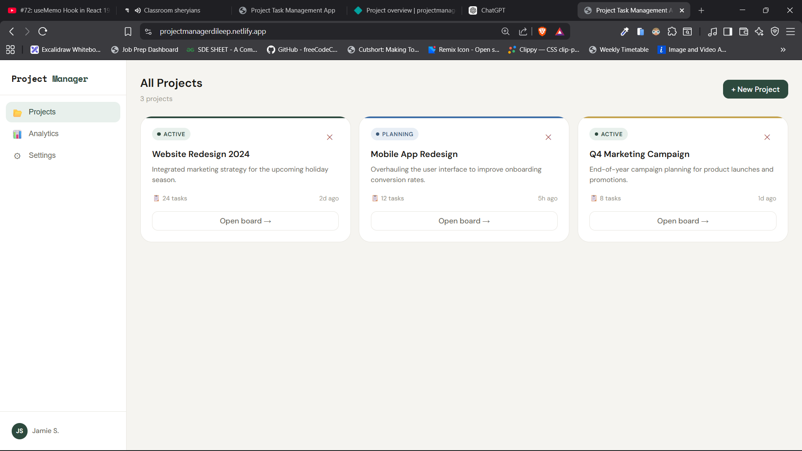
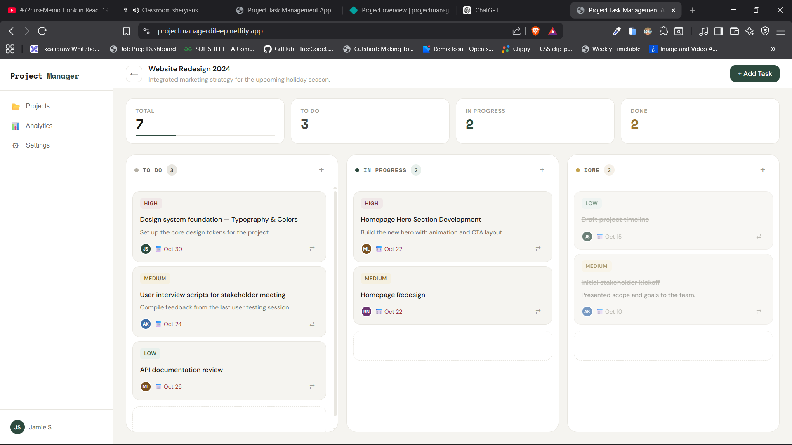
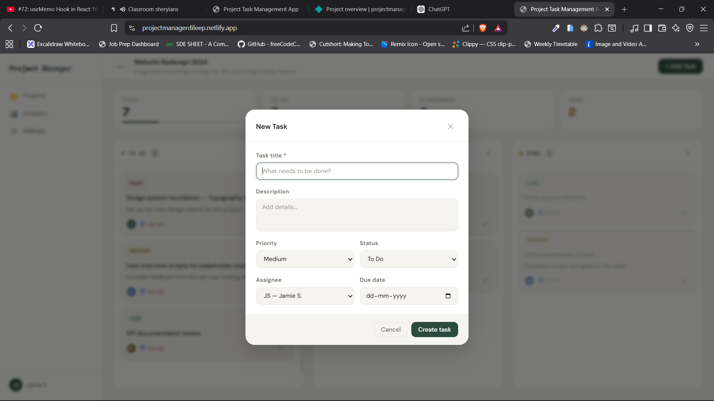

# Project Manager - Modern Task Management App

A **feature-rich Kanban-style Project & Task Management application** built using **React + Redux Toolkit**, designed with a **scalable 4-layer architecture** used in production-grade frontend applications.

This project demonstrates how to build a **modular, maintainable, and scalable React application** with advanced state management and drag-and-drop task workflows.

🔗 **Live Demo**
[https://projectmanagerdileep.netlify.app/](https://projectmanagerdileep.netlify.app/)

💻 **Source Code**
[https://github.com/Dileep-kumawat/Project-Task-Management-App](https://github.com/Dileep-kumawat/Project-Task-Management-App)

---

# ✨ What Makes This Project Interesting

This is not just a CRUD app.
It implements **real-world frontend architecture patterns** used in professional React applications.

Key highlights:

- ✅ **Drag & Drop Kanban board**
- ✅ **Feature-based scalable folder structure**
- ✅ **4-layer architecture (UI / Hooks / State / API)**
- ✅ **Redux Toolkit state management**
- ✅ **Reusable component system**
- ✅ **Project analytics dashboard**

---

# 🖼️ Application Preview

### Projects Dashboard

Manage multiple projects with quick task insights.



---

### Kanban Task Board

Tasks move across workflow stages using **drag & drop**.



```
To Do → In Progress → Done
```

This mimics the workflow used in tools like:

* Trello
* Jira
* Asana

---

### Create Task Modal

Tasks support:

* Title
* Description
* Priority levels
* Status
* Assignee
* Due date



---

# 🧠 Core Features

## 📁 Project Management

Create and manage multiple projects from a centralized dashboard.

Each project shows:

* Total tasks
* Tasks in progress
* Completed tasks

---

## 🗂️ Drag & Drop Kanban Board

Tasks can be **reordered and moved between columns** using drag-and-drop interactions.

Workflow columns:

* **To Do**
* **In Progress**
* **Done**

This improves productivity and task visibility.

---

## 🎯 Priority Management

Each task can be categorized by urgency:

* 🔴 High
* 🟡 Medium
* 🟢 Low

This helps teams focus on the most important work first.

---

## 📅 Deadline Tracking

Tasks can have **due dates**, helping teams stay aligned with deadlines.

---

## 👥 Assignee System

Tasks can be assigned to team members for clear ownership.

---

# 🏗️ Scalable Architecture

This project follows a **feature-driven architecture** combined with a **4-layer separation pattern**.

```
src
 ├── features
 │   ├── projects
 │   │    ├── ui
 │   │    ├── hooks
 │   │    ├── state
 │   │    └── api
 │   │
 │   └── tasks
 │        ├── ui
 │        ├── hooks
 │        ├── state
 │        └── api
 │
 └── shared
```

### Architecture Layers

**UI Layer**

* React components
* Presentation logic

**Hooks Layer**

* Custom hooks
* Encapsulated business logic

**State Layer**

* Redux slices
* Global state management

**API Layer**

* Data handling
* External service communication

This architecture keeps the code:

* **Maintainable**
* **Testable**
* **Scalable**

---

# ⚙️ Tech Stack

### Frontend

* React 19
* JavaScript (ES6+)
* CSS

### State Management

* Redux Toolkit

### UI Pattern

* Kanban Board
* Drag & Drop interactions

### Deployment

* Netlify

---

# 🚀 Getting Started

Clone the repository

```bash
git clone https://github.com/Dileep-kumawat/Project-Task-Management-App.git
```

Navigate into the project

```bash
cd Project-Task-Management-App
```

Install dependencies

```bash
npm install
```

Start development server

```bash
npm run dev
```

The application will run at:

```
http://localhost:5173
```

---

# 💡 What This Project Demonstrates

This project highlights my ability to:

* Build **real-world React applications**
* Design **scalable frontend architectures**
* Implement **Redux state management**
* Create **interactive drag-and-drop UIs**
* Structure projects using **feature-based architecture**

---

# 👨‍💻 About the Developer

Hi, I'm **Dileep Kumawat**, a full stack developer passionate about building scalable and intuitive web applications.

I focus on writing **clean architecture, reusable components, and maintainable code**.

If you're looking for a developer who can **build modern React applications with scalable architecture**, feel free to connect.

---

# 📬 Connect With Me

GitHub
[https://github.com/Dileep-kumawat](https://github.com/Dileep-kumawat)

LinkedIn
[https://www.linkedin.com/in/dileep-kumawat/](https://www.linkedin.com/in/dileep-kumawat/)

Portfolio
[https://dileep3.netlify.app](https://dileep3.netlify.app)

---

⭐ If you like this project, consider **starring the repository**.